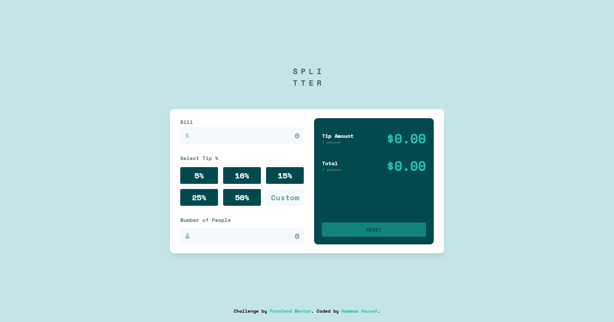

# Frontend Mentor - Tip calculator app solution

This is a solution to the [Tip calculator app challenge on Frontend Mentor](https://www.frontendmentor.io/challenges/tip-calculator-app-ugJNGbJUX). Frontend Mentor challenges help you improve your coding skills by building realistic projects.

## Table of contents

- [Overview](#overview)
  - [The challenge](#the-challenge)
  - [Screenshot](#screenshot)
  - [Links](#links)
- [My process](#my-process)
  - [Built with](#built-with)
  - [What I learned](#what-i-learned)
  - [Continued development](#continued-development)
  - [Useful resources](#useful-resources)
- [Author](#author)
- [Acknowledgments](#acknowledgments)

**Note: Delete this note and update the table of contents based on what sections you keep.**

## Overview

### The challenge

Users should be able to:

- View the optimal layout for the app depending on their device's screen size
- See hover states for all interactive elements on the page
- Calculate the correct tip and total cost of the bill per person

### Screenshot



### Links

- Solution URL: [Add solution URL here](https://your-solution-url.com)
- Live Site URL: [Add live site URL here](https://your-live-site-url.com)

## My process

### Built with

- Semantic HTML5 markup
- Tailwind CSS
- React (with TypeScript)
- Mobile-first workflow
- CSS custom properties
- Animate Css

### What I learned

- How to structure a React app with reusable components (`Input`, `Tip`, `Form`)
- Managing form state and validation in React
- Using Tailwind CSS for rapid UI development
- Handling edge cases and error states for user input
- How to keep code DRY and maintainable

#### Example: Preventing decimals in "Number of People" input

```tsx
onKeyDown={e => {
  if (e.key === "." || e.key === "," || e.key === "e") {
    e.preventDefault();
  }
}}
```

### Continued development

- Improve accessibility (ARIA labels, keyboard navigation)
- Add unit tests for calculation logic and components
- Refactor validation logic into reusable hooks or utilities

### Useful resources

- [Tailwind CSS Documentation](https://tailwindcss.com/)
- [React Docs](https://react.dev/)
- [Frontend Mentor Community](https://www.frontendmentor.io/solutions)

## Author

- Frontend Mentor - [@HammamYousef](https://www.frontendmentor.io/profile/yourusername)

## Acknowledgments

Thanks to the Frontend Mentor community for feedback and inspiration!